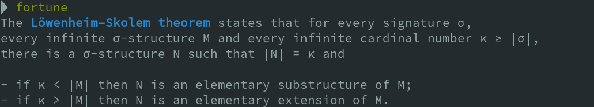

## Screenshots

## Dependencies

- perl (for markup-ansi conversion) : `sudo apt install perl`
- python3 (for cookie/data conversion) : `sudo apt install python3`
- fortune (to display data) : `sudo apt install fortune`

## Install
`sudo make install`

## TODO

1. Add a `fortune` wrapper `fortune-maths`
   - supporting option `-L <theoreme-code>` : generate latex/pdf file
   - supporting option `-P <theoreme-code>` : generate proofs latex/pdf file
2. Add fortunes' version with hyperlink on maths wikipage. These fortunes will be put in `/usr/share/games/fortunes/off` 
3. Add more ansi markup
4. Consider `TERM=dumb` and avoid any ansi markup 
